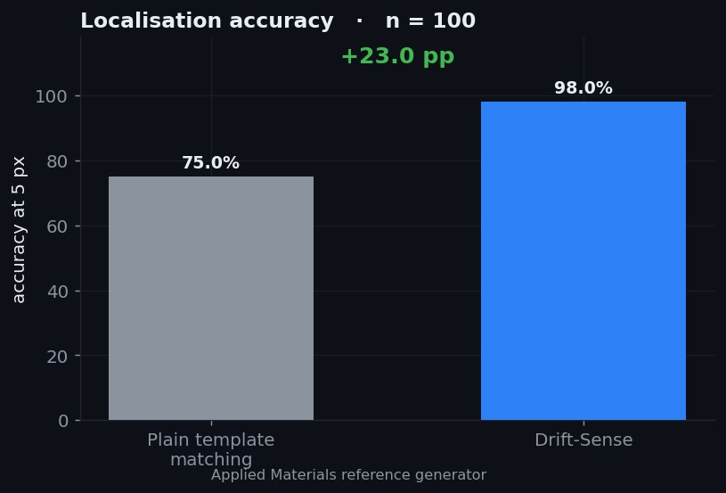
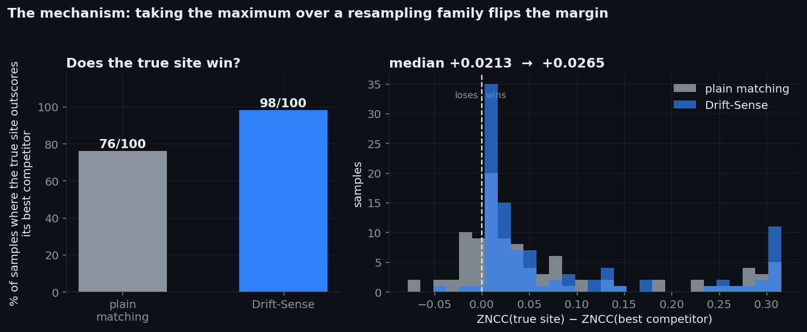
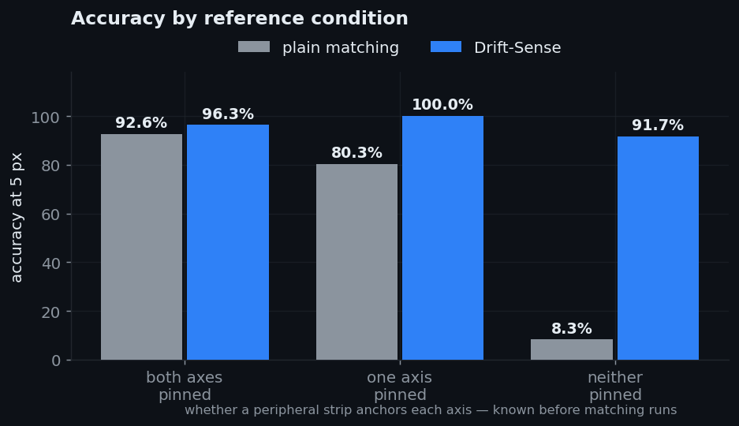
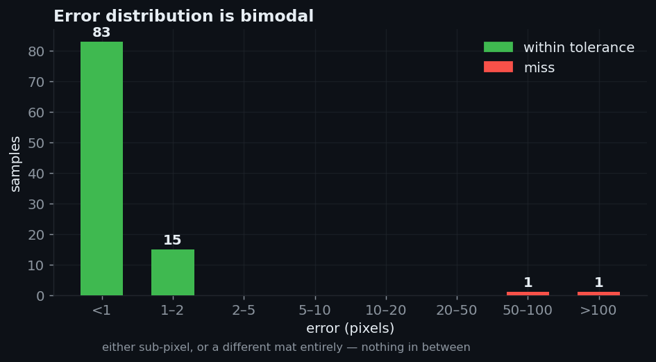
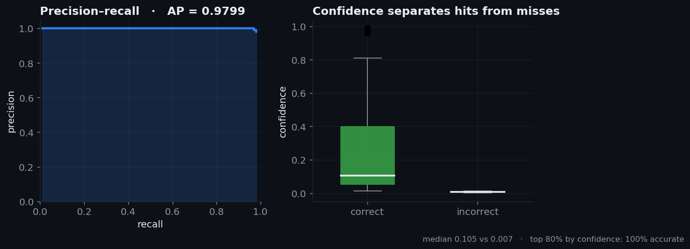
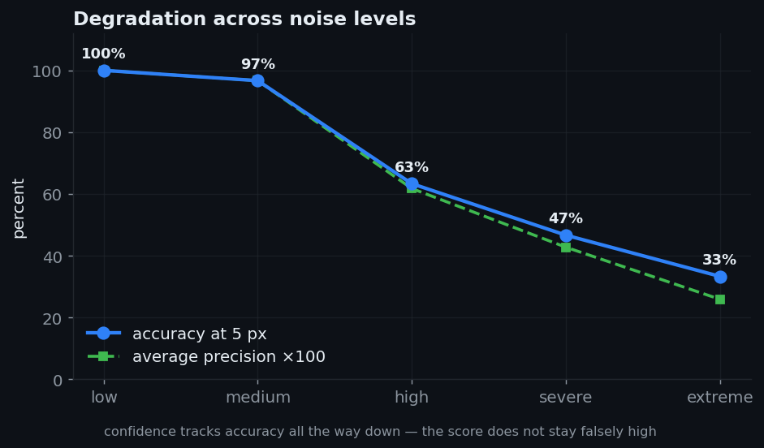

<div align="center">

# Drift-Sense

### Find the one place that is exactly right.

**Team Lattice** · SEMICON India Hackathon 2026 · Problem Statement 2 · Applied Materials

<br>


<br>

*In a repeating layout, many places are approximately right.
Only one is exactly right.*

</div>

---

## The problem

A wafer inspection tool must return to the same site on a die thousands of
times a day. The stage drifts between visits, so it lands a few pixels off
— and it cannot tell, because every die carries the same repeating circuit
layout and the wrong site looks like the right one.

| | Reference | Search |
|:--|:--|:--|
| Size | 1000 × 1000 | 1000 × 1000 |
| Pixel | 1 nm | 10 nm |
| Field | 1 µm | 10 µm |
| Dose | high | low, noisier |

Find the centre of the region in the search image where the reference
pattern appears, shrunk tenfold. **Tolerance: 5 px.**

In DRAM the lattice repeats every **6.4 px** in search coordinates. The
tolerance is narrower than one lattice cell — land on the neighbouring
crossing and it counts as a miss.

---

## Result

<div align="center">



</div>

Measured on **100 pairs from Applied Materials' own reference generator**,
timed from the shipped `localize.py`.

| | Value |
|:--|--:|
| Accuracy at 5 px | **98.0 %** |
| Plain template matching | 75.0 % |
| Accuracy at 1 px | 83.0 % |
| Median error | **0.65 px** |
| p95 error | 1.29 px |
| Average precision | **0.9799** |
| Computation time | ~1.1 s / pair |
| Model size | **none** |

---

## Why it works

The reference must be reduced tenfold before it can be compared with the
search image. That is where ordinary template matching loses the problem.

The reference was cropped from the die at an **integer nanometre** position
`x0`, while the search image samples the die in blocks of ten:

```
template pixel m   averages   [ x0 + 10m ,  x0 + 10m + 10 )
search   pixel j   covers     [     10j  ,      10j  + 10 )
```

Those grids coincide only when `x0 ≡ 0 (mod 10)` — **one time in ten**.
Otherwise the template is a fractionally shifted rendering of the same
structure.

That misalignment falls **entirely on the true site**. It is the one place
where an exact match exists; every wrong site in a periodic layout is
approximate regardless. A misaligned template throws away the true site's
only advantage and costs its competitors nothing.

So instead of one template, `localize.py` builds a **family** of them at
sub-pixel sampling offsets and takes the maximum over the family.

<div align="center">



</div>

The margin between the true site and its best competitor **changes sign**.
That is the whole method.

<details>
<summary><b>Two implementation details that matter</b></summary>

<br>

**Exact resampling.** Templates are built by area-averaging at a fractional
offset, computed from an integral image. Shifting the image and resampling
instead would apply an interpolation filter across the whole template,
giving a *blurred approximation* of the aligned template rather than the
aligned template. An earlier experiment that did exactly that reported a
false null.

**Resolution matching.** Both images are low-passed by a small Gaussian
before matching. This is **not denoising** — removing noise from the search
image entirely was measured to fix none of the failures. The reference is
exposed at high dose and then averaged tenfold, cutting its noise by
another factor of ten, so the template is far sharper than anything the
search image can carry. A mild low-pass brings the two into agreement.

Measured across noise levels, accuracy at 5 px:

| σ | AM data | low | medium | high | severe |
|--:|--:|--:|--:|--:|--:|
| 0.0 | 96.0 | 100.0 | 91.7 | 65.0 | 41.7 |
| **1.0** | **98.0** | **100.0** | **96.7** | **68.3** | **51.7** |
| 1.5 | 99.0 | 95.0 | 83.3 | 68.3 | 51.7 |

σ = 1.0 never loses anywhere. σ = 1.5 scores higher on one dataset but
costs 5 points at *low* and 8 at *medium*, so it is fitted to a single
noise level. **1.0 ships.**

Nothing is fitted, trained or estimated. That is why the result transfers
unchanged between independently written generators.

</details>

---

## Where the difficulty lives

<div align="center">



</div>

A **peripheral strip** — the flat band of sense amplifiers and routing
between sub-array mats — is the only aperiodic landmark in the field. Every
measured failure was a reference containing none.

That condition is detectable **from the reference alone, before matching
runs**, which makes it a failure predictor as well as an explanation.

<div align="center">



</div>

The error distribution is bimodal and sharply so. **Nothing lands between
2 px and 50 px.** The method either finds the correct site to sub-pixel
precision or lands in a different mat entirely — there is no intermediate
regime of slightly-wrong answers.

---

## Knowing when it is wrong

<div align="center">



</div>

Every failure sits in the bottom fifth by confidence. The **top 80 % by
confidence are 100 % accurate**.

For an inspection tool that distinction matters more than the accuracy
figure: a tool that knows it missed can re-acquire, while a confidently
wrong tool measures the wrong site all day.

<div align="center">



</div>

Average precision tracks accuracy all the way down, from 1.000 to 0.149.
The score does not remain falsely high once the method stops working.

---

## Worked failure

Applied Materials ask for **one honest example of where the method fails,
and why.**

<div align="center">


</div>

| | |
|:--|:--|
| True centre | (88.4, 779.5) |
| Predicted | (154.1, 637.1) |
| Error | **156.84 px** |
| Confidence | **0.000** |
| Condition | no strip on either axis |

The two candidate regions, bottom right, are visibly the same pattern. They
differ only in lattice phase and in the noise realisation of that capture.
No comparison of appearance can separate them, because there is nothing
aperiodic in either to compare.

It reported **zero confidence** against a median of 0.105 on correct
predictions. It did not merely fail — it said so.

Full analysis in **[`docs/FAILURES.md`](docs/FAILURES.md)**.

---

## Quick start

```bash
git clone https://github.com/yashwanth-maram/drift-sense.git
cd drift-sense
pip install -r requirements.txt
```

**Generate data**

```bash
python generate_dataset.py --style DRAM   --n 30 --out ./data
python generate_dataset.py --style FinFET --n 30 --out ./data_ff --noise severe
```

**Localise**

```bash
python localize.py --reference ref.png --search search.png
```

```
746.60,318.80
```

One line on stdout: the centre in search-image pixels. Diagnostics go to
stderr, so the output stays clean for a harness.

<details>
<summary><b>All flags</b></summary>

<br>

**`generate_dataset.py`**

| Flag | Meaning |
|:--|:--|
| `--style` | `DRAM` or `FinFET`. Aliases: `--architecture`, `--architectures` |
| `--n` | number of pairs. Aliases: `--num-samples`, `--count` |
| `--out` | output directory. Aliases: `--output-dir`, `--output` |
| `--noise` | `clean`, `low`, `medium`, `high`, `severe`, `extreme` |
| `--seed` | base seed; every sample is a pure function of `(seed, index)` |

Individual imaging parameters — `--dose-search`, `--shear-amplitude-px`,
`--speckle-sigma` and the rest — can be overridden directly. See `--help`.

**`localize.py`**

| Flag | Meaning |
|:--|:--|
| `--confidence` | append the confidence as a third value |
| `--verbose` | score, confidence, offset and timing to stderr |
| `--sigma` | resolution-matching low-pass; `0` disables |
| `--step` | offset sampling stride; default 2 |
| `--tiebreak` | `search` (default) or `none` |

Runs from any working directory. Handles missing and corrupt files with
exit code 2, colour input, paths containing spaces, and references at sizes
other than 1000 × 1000.

</details>

**Reproduce every number**

```bash
python experiments/metrics.py    --data ./data --n 100 --baseline
python experiments/make_plots.py --data ./data --n 100 --out ./figures --noise
python experiments/make_figures.py --data ./data --out ./figures
```

---

## The generator

<details>
<summary><b>Five layers, and what each contributes</b></summary>

<br>

| Layer | Contributes |
|:--|:--|
| **Layout** | DRAM 6F² word/bit lines with contacts, or FinFET fins with gate bars. Six presets per family spanning several nodes. |
| **Zones** | Sub-array mats separated by peripheral strips, each mat drawing its own preset — so one field carries several pitches, as a real die does. |
| **Process** | Line-edge roughness with a correlation length, corner rounding, CD bias, missing contacts. |
| **SEM imaging** | Shared beam PSF, **edge-brightening**, Poisson shot noise by dose, detector noise, speckle, raster drift, row jitter, charging streaks, vignette, gamma. |
| **Manifest** | Ground truth plus every parameter, so any pair regenerates exactly from its row. |

Three things the reference generator does not have:

- **Edge-brightening** — listed as mandatory in the problem statement
- **Line-edge roughness** — perfectly straight edges are the clearest tell of a synthetic SEM image
- **Per-sample derived RNG** — theirs shares one stream across the loop, so changing any imaging parameter silently shifts the geometry too

Validated against the reference generator on five independent statistics —
strip positions, strip widths, lattice pitches, noise floors and image
format — at **6× the speed**.

Every parameter is justified against public sources in
**[`docs/CITATIONS.md`](docs/CITATIONS.md)** — 18 references, no
proprietary fab data.

</details>

---

## A discrepancy worth stating

The two published descriptions of the tie-break rule disagree.

- The Applied Materials deck: closest to the **reference** image centre
- The i4C problem statement: closest to the **search** image centre

This implementation uses the **search-image centre**, because the reference
centre is not a location within the search image and so cannot order
candidates there. `--tiebreak none` disables the rule.

The tolerance window matters more than it looks. Applying the rule with a
wide window was measured to cost **15 points**, because it encodes a
physical prior the test data does not contain: a real tool lands *near* its
target, but the reference generator places crops uniformly at random. The
shipped threshold fires only when two peaks are genuinely
indistinguishable. Measurements in
[`docs/FAILURES.md` §9.2](docs/FAILURES.md).

---

## Repository

```
generate_dataset.py      dataset generator            ← scored artifact
localize.py              localisation inference       ← scored artifact
requirements.txt         pinned dependencies

driftsense/
  generator/             patterns · zones · SEM imaging chain
  localize.py            shared helpers used by experiments

docs/
  CITATIONS.md           18 references, one per generator parameter
  FAILURES.md            root cause · oracles · 16 rejections

experiments/
  metrics.py             accuracy · AP · timing · conditions
  make_plots.py          the figures above
  make_figures.py        success and failure visuals
  ...                    the measurement record behind FAILURES.md

figures/                 generated, committed for the docs
```

**No deep-learning model is used**, so submission items 4 and 5 — model
weights and a training notebook — are not applicable. The classical method
was chosen because the problem geometry is fully constrained, and because
it leaves nothing that can fail to load on the evaluator's machine.

`driftsense/verifier.py` and `driftsense/residual.py` implement approaches
that were **measured and rejected**. They are retained so the results in
`docs/FAILURES.md` remain reproducible, and are imported by nothing on
either scored path.

---

## Method in brief

<div align="center">

```
reference 1000×1000                    search 1000×1000
        │                                     │
        ├── build template family             │
        │   at sub-pixel offsets              │
        │   (exact area-average)              │
        │                                     │
        └──────── low-pass both ──────────────┤
                        │                     │
                  ZNCC each offset ───────────┘
                        │
              max over the family
                        │
              centre tie-break  ·  sub-pixel refine
                        │
                    ( x , y ) + confidence
```

</div>

---

<div align="center">

**Team Lattice**

*Everything repeats. Exactness does not.*

</div>