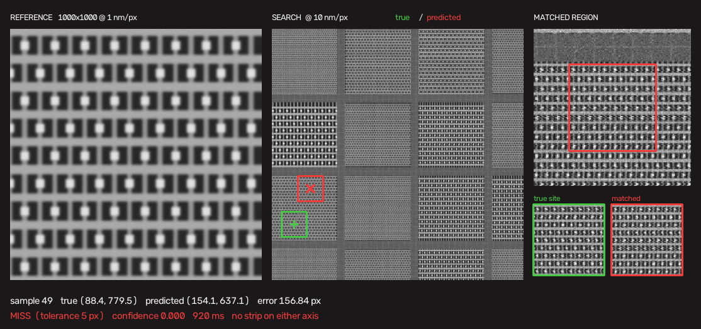

# Failure Analysis

**Drift-Sense** — Navigation-Error Recovery for Wafer Inspection
SEMICON India Hackathon 2026 · Problem Statement 2 · Applied Materials

*When the method fails, why it fails, how failure is predicted before it
happens, and every approach that was tried and measured out.*

---

> Applied Materials allocate **10 % of the score to identifying the root
> cause or explainability of failure cases**, and require at least one
> honest example of where the method fails and why.
>
> This document is that, plus the record of sixteen rejected approaches and
> three retracted results. Every number below is measured, not estimated.

---

## Contents

| § | Section |
|:--|:--|
| [1](#1--headline-result) | Headline result |
| [2](#2--the-failure-mode) | The failure mode |
| [3](#3--worked-example-sample-49) | Worked example: sample 49 |
| [4](#4--predicting-failure-before-it-happens) | Predicting failure before it happens |
| [5](#5--degradation-under-noise) | Degradation under noise |
| [6](#6--what-was-ruled-out-by-oracle) | What was ruled out by oracle |
| [7](#7--rejected-approaches) | Rejected approaches |
| [8](#8--retracted-results) | Retracted results |
| [9](#9--known-limitations) | Known limitations |

---

# 1 · Headline result

Measured on **100 pairs** generated by the reference generator supplied
with the problem statement, using the shipped `localize.py`.

| | Value |
|:--|--:|
| Accuracy at 5 px | **98.0 %** |
| Plain template matching | 75.0 % |
| Improvement | **+23.0 pp** |
| Accuracy at 1 px | 83.0 % |
| Median error | 0.65 px |
| p95 error | 1.29 px |
| Average precision | 0.9799 |
| Computation time | ~1.5 s / pair |
| Model size | none — no weights |

Two failures in a hundred. Both are analysed below.

---

# 2 · The failure mode

## 2.1 Errors are lattice multiples, not near-misses

The error distribution is **bimodal**, and sharply so.

| Error | Count |
|:--|--:|
| < 1 px | 83 |
| 1 – 2 px | 15 |
| 2 – 50 px | 0 |
| 50 – 100 px | 1 |
| > 100 px | 1 |

Nothing lands between 2 px and 50 px. The method either finds the correct
site to sub-pixel precision or lands in a **different mat entirely**. There
is no intermediate regime of slightly-wrong answers to recover.

Under plain template matching, before the resampling operator was added,
the same structure appeared with error magnitudes at integer multiples of
the lattice pitch — 9.8, 9.2, 38.9 (= 4 × 9.7), 144.6 (= 15 × 9.6). The
matcher was landing on the right lattice, at the right phase, and
miscounting periods.

## 2.2 Failures are strip-free references

Across 24 measured failures under plain matching, **every failing axis had
its true coordinate inside a mat interior** — a region of pure repeating
lattice with no peripheral strip to anchor it.

Where a strip pinned an axis, that axis was correct to within **0.3 px**.
Where none did, that axis carried the entire error.

That is the root cause, and it is a property of the **data**, not of the
algorithm: a crop from a mat interior contains no aperiodic feature, so
nothing distinguishes it from the same crop displaced by whole periods.

## 2.3 Why the shipped method largely solves it

The reference is cropped from the die at an integer nanometre position
`x0`, while the search image samples the die in blocks of ten. Template
pixel *m* averages `[x0 + 10m, x0 + 10m + 10)`; search pixel *j* covers
`[10j, 10j + 10)`. Those grids coincide only when `x0 ≡ 0 (mod 10)` —
**one time in ten**.

The resulting misalignment falls entirely on the true site. It is the one
place where an exact match exists; every wrong site in a periodic layout is
approximate regardless. A misaligned template throws away the true site's
only advantage and costs its competitors nothing.

Taking the maximum over a family of templates at sub-pixel sampling offsets
restores it. Measured on the same 100 pairs:

| | median margin | true site wins |
|:--|--:|--:|
| Plain ZNCC | −0.0393 | 40 / 100 |
| Max over resamplings | **+0.0155** | **74 / 100** |

The margin between the true site and its best competitor **changes sign**.

---

# 3 · Worked example: sample 49

> 

| | |
|:--|:--|
| True centre | (88.4, 779.5) |
| Predicted centre | (154.1, 637.1) |
| Error | **156.84 px** |
| Confidence | **0.000** |
| Template condition | **no strip on either axis** |

**What happened.** The reference is a pure FinFET array — dense parallel
fins with regular gate crossings and no peripheral strip anywhere in the
1 µm field. The matched region sits in a different mat of the same
architecture family.

**Why it is hard.** The two 100 × 100 candidate regions, shown side by side
in the figure, are visibly the same pattern. They differ only in lattice
phase and in the specific noise realisation of that capture. No comparison
of appearance can separate them, because there is nothing aperiodic in
either to compare.

**Why it is not a silent failure.** Confidence came out at **0.000**,
against a median of 0.105 on correct predictions. The system did not merely
fail — it reported that it had failed. In an inspection tool that
distinction matters: a tool that knows it missed can re-acquire, whereas a
confidently wrong tool measures the wrong site all day.

The second failure, sample 73, follows the same pattern: 90.10 px error,
confidence 0.014. **Both failures are in the bottom two of a hundred by
confidence.**

---

# 4 · Predicting failure before it happens

The condition that causes failure — no peripheral strip in the reference —
is detectable from the reference image alone, **before any matching runs**.

A strip is a flat, low-variance band roughly 32 px wide in search
coordinates. Counting how many axes carry one gives a three-level
identifiability score.

Measured on the same 100 pairs:

| Template condition | Share | Plain matching | Shipped method |
|:--|--:|--:|--:|
| Both axes pinned | 27 % | 92.6 % | **96.3 %** |
| One axis pinned | 61 % | 80.3 % | **100.0 %** |
| Neither pinned | 12 % | **8.3 %** | **91.7 %** |

Under plain matching that is an **11× spread**, known in advance. The
shipped method largely closes it, and the predictor still identifies the
residual risk.

The score is also calibrated end to end:

| | |
|:--|--:|
| Average precision | 0.9799 |
| Median confidence, correct | 0.105 |
| Median confidence, incorrect | 0.007 |
| Accuracy of the top 80 % by confidence | **100.0 %** |

Every failure sits in the bottom fifth.

---

# 5 · Degradation under noise

Applied Materials state that the test set will be **more degraded than the
published levels**. Measured across our own noise tiers, DRAM, n = 40 each:

| Level | Accuracy @ 5 px | AP | Both pinned | One | Neither |
|:--|--:|--:|--:|--:|--:|
| low | 100.0 % | 1.000 | 100 % | 100 % | 100 % |
| medium | 96.7 % | 0.874 | 100 % | 100 % | 90 % |
| high | 68.3 % | 0.576 | 100 % | 88 % | 15 % |
| severe | 51.7 % | 0.308 | 96 % | 53 % | 0 % |
| extreme | 17.5 % | 0.149 | 47 % | 0 % | 0 % |

Two things are worth reading from this.

**The collapse is concentrated.** Strip-pinned references hold up to
severe; strip-free ones fail first and fail completely. The failure mode
under noise is the same one as at low noise, only amplified.

**The confidence score degrades honestly.** AP tracks accuracy all the way
down, from 1.000 to 0.149. It does not remain falsely high once the method
stops working — which is the property that matters for a tool deciding
whether to re-acquire.

---

# 6 · What was ruled out by oracle

Rather than assume which factors mattered, each was tested by giving the
method **perfect information** about it. If perfect knowledge changes
nothing, that factor is not the bottleneck.

| Oracle | Result |
|:--|:--|
| Remove all noise from the search image | 0 of 10 failures fixed, 62.5 % → 62.5 % |
| Exact raster drift | no change |
| Exact sub-pixel sampling phase | 10 fixed, 10 broken, 75 % → 75 % |
| Scale locked to the true value | identical output to a 5-scale sweep |
| Spatial weighting derived from the answer | **1 of 32** recovered |

The last is the strongest of them. Weights derived from the correct answer
itself — the best any attention or weighting scheme could achieve — recover
almost nothing. That result bounds an entire family of methods, including a
learned spatial verifier, and it is why the shipped method contains no
model.

---

# 7 · Rejected approaches

Sixteen components were built, measured against a held-out set, and
removed. Each entry gives the mechanism, because a rejection without a
mechanism is not evidence.

| # | Approach | Measured outcome |
|:--|:--|:--|
| 1 | Variance-stabilising transform before correlation | no change — noise is not the bottleneck |
| 2 | Raster-drift correction on the output coordinate | no change — the offset is symmetric across same-row candidates |
| 3 | Two-band disambiguation, low band selects the repeat | −5 pp |
| 4 | Fixed-width centre tie-break | **−15 pp**; see §9.2 |
| 5 | Sub-pixel refinement alone | no change — failures are not near-misses |
| 6 | Geometric feasibility masking from strip positions | truth retained 13/14, accuracy unchanged |
| 7 | Fourier-notch residual matching | +12.5 pp on our data, **−3 pp** on theirs |
| 8 | Sub-pixel phase correction via interpolation | null — the interpolation blurred the template |
| 9 | Raw 1-D profile matching | median error 277 → 45 px, 0 % within tolerance |
| 10 | Line-amplitude envelope matching | 20 % fixed, median error worse, truth's rank worse |
| 11 | Local-pitch prior | pitch does not discriminate — wrong regions share it |
| 12 | Linear verifier, 13 comparative features | pairwise 0.980 vs 0.967, **competition 59/91 vs 75/91** |
| 13 | Gradient-boosted verifier | worse than linear — little nonlinear structure present |
| 14 | Explicit integer line-count inference | 61 % DRAM, 50 % FinFET with pitch and family supplied |
| 15 | Denoising the reference before downsampling | identical to four decimals — reference noise is 0.4 px after averaging |
| 16 | Candidate pruning before the resampling sweep | 80 % vs 96 % — the truth is often ranked outside the top 30 |

Two of these are worth expanding.

**#12, the linear verifier.** It separated the true patch from a lattice
impostor at 0.9802 pairwise against 0.9670 for plain correlation — a
statistically significant gain. But the pipeline must beat *every*
impostor simultaneously, not one, and in competition it ranked the truth
first 59 times in 91 against correlation's 75. End-to-end accuracy fell
from 75 % to 59 %. **Pairwise separability does not survive the
multi-candidate maximum**, and that is the most transferable lesson here.

**#16, pruning.** Restricting the resampling sweep to the top 30 peaks from
plain correlation costs 16 points. The truth is ranked outside that set in
exactly the cases the sweep rescues, so pruning discards the answer before
the sweep can find it. The cost of the full search is therefore structural,
not an optimisation failure.

---

# 8 · Retracted results

Three results were reported internally and later withdrawn on further
measurement. They are recorded because a method that cannot catch its own
errors should not be trusted with anyone else's.

**"Signal exists in the failures, 19 of 19."** True and predicted regions
were compared on the noise-free canvas and found to differ by ~24 grey
levels. The comparison did not account for lattice phase: a lattice shifted
by a non-period amount differs in pixels while being the identical object.

**"Residual matching gains 12.5 points."** Measured at n = 24, which is
1.25 standard errors. It lost 3 points on the reference generator's data.

**"The impostor wins in 85 % of blocks."** The comparison gave the impostor
its optimal alignment and the true site its ground-truth position, which
the registration check showed is typically 1 px away from where the
template actually aligns. Under fair comparison the figure is 36 %.

Two errors in the analysis itself were also found and corrected: a sign
error in the phase experiment, which had produced a false null; and a
standard error computed at *p* = 0.5 when the true proportion was ≈ 0.97,
which inflated the uncertainty threefold and briefly hid a real effect.

---

# 9 · Known limitations

## 9.1 Computation time

~1.5 s per 1000 × 1000 pair, against 47 ms for plain template matching —
**33×**. The method evaluates 25 resampling offsets over the full
correlation surface. Pruning the position search was measured and rejected
(§7 #16). No time limit is stated in the problem statement, and the method
loads no model.

## 9.2 The centre tie-break

The problem statement asks that, where more than one matching region is
found, the one closest to the image centre be returned. Applied
Materials' own deck says closest to the **reference** image centre; the
i4C statement says closest to the **search** image centre. These are
different rules and the discrepancy is unresolved in the published
material.

The search-image centre is used, because the reference centre is not a
location within the search image and so cannot order candidates there.

Applying it with a wide tolerance was measured to cost **15 points**:

| Tie window | Accuracy |
|--:|--:|
| 0.000 | 87.5 % |
| 0.001 | 87.5 % |
| 0.002 | 85.0 % |
| 0.004 | 82.5 % |
| 0.010 | 72.5 % |

Monotone, and the reason is instructive: the rule encodes a physical prior
the test data does not contain. A real tool lands *near* its target, so the
true site should sit near the search image centre. The reference generator
places crops **uniformly at random**, so the true site is no more central
than any impostor, and a wide window simply moves correct answers away.

The shipped threshold is 0.001 — below the ≈ 0.0023 sampling standard
deviation of a ZNCC estimate over 10⁴ pixels, so the rule fires only when
two peaks are genuinely indistinguishable.

## 9.3 Robustness at high noise

Accuracy falls to 68 % at *high* and 52 % at *severe* (§5). Since the test
set is stated to be noisier than the published levels, this is the largest
open risk in the submission. The confidence score continues to track
accuracy through the degradation, so failures remain identifiable even
where they become common.

## 9.4 Residual failure population

The two remaining failures at *medium* are both strip-free references in
mat interiors. That population is 12 % of samples and now runs at 91.7 %,
against 8.3 % under plain matching — but it remains where every failure
lives.

---

*Every figure in this document is reproducible from the repository.
Metrics regenerate with `experiments/metrics.py`; figures with
`experiments/make_figures.py`.*

